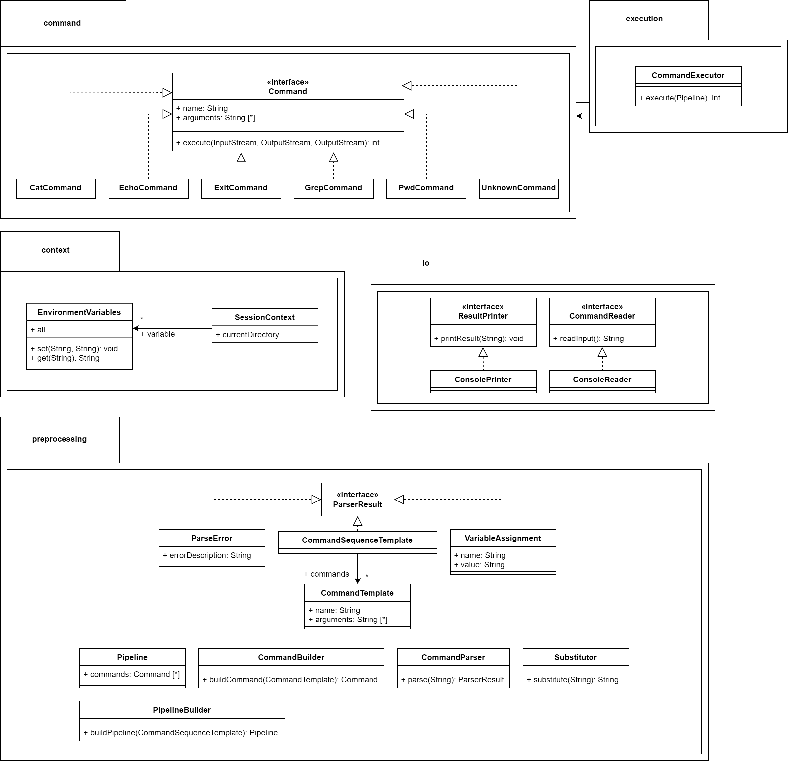
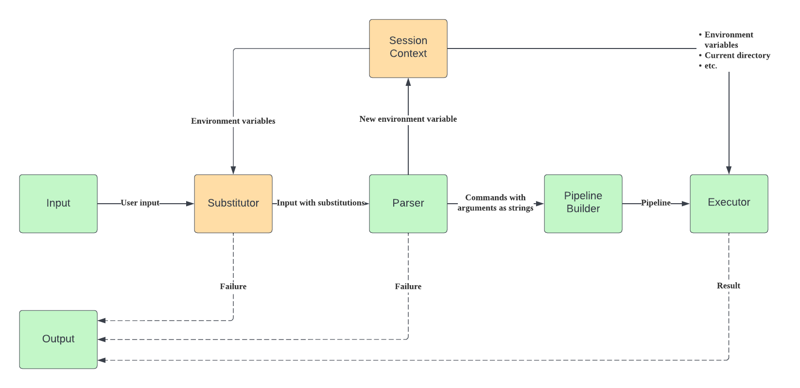

# Архитектура CLI

## Команда

- Светлана Шмидт https://github.com/lana243
- Никита Строганов https://github.com/ideaseeker
- Сергей Поспелов https://github.com/sergeypospelov

## Сборка и запуск

- `gradlew jar`
- `java -jar build/libs/architecture-design-course-2022-1.0-SNAPSHOT.jar`

## Схемы

### Class Diagram

### Dataflow Diagram

Ниже приведено описание архитектуры сразу для __фазы 2__. Изменения для __фазы 1__ явно написаны текстом под соответствующей секцией.

В нашей системе есть несколько сущностей. Ниже приведено описание основных из них.

## SessionContext

`SessionContext` хранит некоторый набор (мутабельных) свойств, общих на протяжении всего выполнения программы. В нём содержится поле `EnvironmentVariables`, соответствующее текущему состоянию объявленных переменных и `currentDirectory` -- текущая директория.

`SessionContext` инициализируется при запуске программы.

### Фаза 1

Отсутствует поле `EnvironmentVariables`.

## Substitutor

`Substitutor` получает на вход пользовательский input в виде строчки, выделяет имена переменных для подстановки, обращается к `SessionContext`'у для получения значений этих переменных и возвращает строчку с подставленными переменными. При этом подстановка не происходит в строки с одинарными кавычками.

API:
- `constructor(SessionContext)` -- инициализирует `Substitutor` каким-то `SessionContext`'ом
- `substitute(String): String` -- выполняет подстановку

Данный класс может выкинуть `BashException` с каким-то описанием в случае неудачной подстановки (синтаксическая ошибка, например).

### Фаза 1
В варианте без подстановок, можно полностью выкинуть этот класс, либо считать, что он выполняет тождественное преобразование.

## ParserResult
`ParserResult` -- интерфейс для результатов парсинга, следующие классы реализуют данный интерфейс:
### CommandTemplate
`CommandTemplate` -- это дата-класс для представления распаршенной команды. Состоит из имени команды и списка её аргументов в виде строк.
### VariableAssignment
`VariableAssignment` -- дата-класс для представления новых переменных. Состоит из имени новой переменной и ее значения.
### ParseError
`ParseError` -- дата-класс для представления ошибок во время парсинга. Содержит сообщение об ошибке.

## CommandParser

`CommandParser` получает на вход строчку, разбивает её на токены и группирует их на `ParserResult`. Для этого используется разбиение по пробелам и символам `|`. На выходе получается список `ParserResult`.

### Фаза 1
Список всегда будет состоять из одной команды, либо можно возвращать не список, а единственный `CommandTemplate`.

## Command

Интерфейс для команды, состоящий из имени команды и аргументов. Наследники реализуют функцию `execute`. Объект, вызывающий функцию `execute`, обязан знать, откуда читать данные и куда писать результат.

API:
- `execute(inputStream, outputStream)`

## CommandBuilder

`CommandBuilder` реализует логику создания `Command` из `CommandTemplate`. 

## CommandExecutor

`CommandExecutor` исполняет переданную команду и управляет потоками ввода-вывода.

API:
- `execute(Command): String` -- вычисляет результат выполнения пайплайна, а именно:
    - поддерживается `curInputStream = System.in` и `curOutputStream = ByteArrayOutputStream()`
    - очередной команде на вход передаётся `curInputStream` и `curOutputStream`
    - затем `curInputStream = curOutputStream.toByteArray().asInputStream()`, `curOutputStream = ByteArrayOutputStream()`, таким образом реализуется пайп
    - в конце `curOutputStream` преобразуется в строчку и возвращается в качестве результата

### Фаза 1

Выполняет единственную команду

## Точка входа

В качестве точки входа используется функция main, в которой происходит создание и управление объектами.

## Подробности реализации

- Для разбора аргументов командной строки используется библиотека [kotlin-argparser](https://github.com/xenomachina/kotlin-argparser), как наиболее удобная и простая из существующих. В качестве альтернативы можно было бы использовать [clikt](https://github.com/ajalt/clikt) или [kotlinx-cli](https://github.com/Kotlin/kotlinx-cli).
