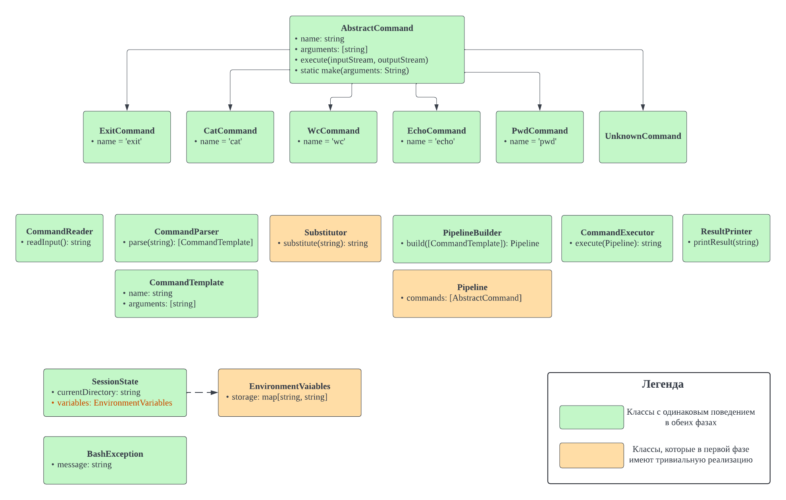
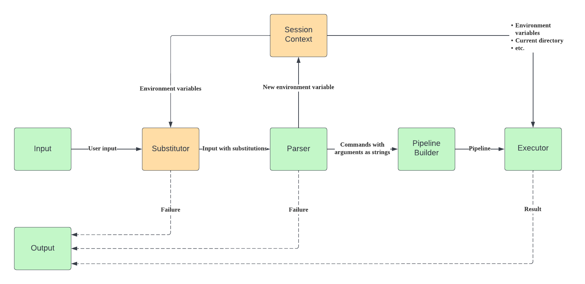

# Архитектура CLI

## Схемы

### Class Diagram

### Dataflow Diagram

Ниже приведено описание архитектуры сразу для __фазы 2__. Изменения для __фазы 1__ явно написаны текстом под соответствующей секцией.

В нашей системе есть несколько сущностей. Ниже приведено описание основных из них. 

## SessionContext

`SessionContext` хранит некоторый набор (мутабельных) свойств, общих на протяжении всего выполнения программы. В нём содержится поле `EnvironmentVariables`, соответствующее текущему состоянию объявленных переменных и `currentDirectory` -- текущая директория.

`SessionContext` инициализируется при запуске программы.

### Фаза 1

Отсутствует поле `EnvironmentVariables`.

## Substitutor

`Substitutor` получает на вход пользовательский input в виде строчки, выделяет имена переменных для подстановки, обращается к `SessionContext`'у для получения значений этих переменных и возвращает строчку с подставленными переменными. При этом подстановка не происходит в строки с одинарными кавычками.

API:
- `constructor(SessionContext)` -- инициализирует `Substitutor` каким-то `SessionContext`'ом
- `substitute(String): String` -- выполняет подстановку

Данный класс может выкинуть `BashException` с каким-то описанием в случае неудачной подстановки (синтаксическая ошибка, например).

### Фаза 1
В варианте без подстановок, можно полностью выкинуть этот класс, либо считать, что он выполняет тождественное преобразование.

## CommandTemplate

`CommandTemplate` -- это дата-класс для представления распаршенной команды. Состоит из имени команды и списка её аргументов в виде строк.

## CommandParser

`CommandParser` получает на вход строчку, разбивает её на токены и группирует их на `CommandTemplate`ы. Для этого используется разбиение по пробелам и символам `|`. На выходе получается список `CommandTemplate`ов.  

Если строчка представляет собой объявление новой переменной окружения, то `CommandParser` делает соответствующую запись в `SessionContext` и завершает обработку данной команды. То есть `PipelineBuilder` не запускается.

API:
- `parse(String): List<CommandTemplate>`

Данный класс может выкинуть `BashException` с каким-то описанием в случае неудачного парсинга (синтаксическая ошибка, например).

### Фаза 1
Список всегда будет состоять из одной команды, либо можно возвращать не список, а единственный `CommandTemplate`.

## AbstractCommand

Базовый класс для команды, состоящий из имени команды и аргументов. Наследники реализуют функцию `execute`. Объект, вызывающий функцию `execute`, обязан знать, откуда читать данные и куда писать результат.

API:
- `execute(inputStream, outputStream)`

## Pipeline

`Pipeline` -- это дата-класс для представления последовательности распаршенных команд, то есть `List<AbstractCommand>`. 

Если `command1` в списке идёт после `command2`, то считается, что стандартный вывод первой команды будет перенаправлен в стандартный ввод второй команды.

### Фаза 1
Список всегда будет состоять из одной команды, либо можно возвращать не список, а единственный `CommandTemplate`.

## PipelineBuilder

`PipelineBuilder` реализует логику создания `Pipeline`а из списка `CommandTemplate`ов. Для этого он преобразует каждый `CommandTemplate` в `AbstractCommand`.

Для поиска билдера для команды используется переданный в конструктор мап из имени команды в её билдер. Если команды нет в списке, то создаётся специальная команда-обработчик неизвестных команд (`Runtime.exec(...)`).

API:
- `constructor(Map<String, (List<String>) -> AbstractCommand>)` -- инициализирует текущий `PipelineBuilder` списком доступных комманд. `(List<String>) -> AbstractCommand` -- билдер для команды.
- `build(List<CommandTemplate>): Pipeline` -- преобразует список команд в виде строчек в пайплайн

### Фаза 1

Пайплайн будет состоять из одной команды, либо можно просто возвращать `AbstractCommand`.

## CommandExecutor

`CommandExecutor` исполняет переданный пайплайн и управляет потоками ввода-вывода. 

API:
- `execute(Pipeline): String` -- вычисляет результат выполнения пайплайна, а именно:
  - поддерживается `curInputStream = System.in` и `curOutputStream = ByteArrayOutputStream()`
  - очередной команде на вход передаётся `curInputStream` и `curOutputStream`
  - затем `curInputStream = curOutputStream.toByteArray().asInputStream()`, `curOutputStream = ByteArrayOutputStream()`, таким образом реализуется пайп
  - в конце `curOutputStream` преобразуется в строчку и возвращается в качестве результата

### Фаза 1

Выполняет единственную команду
